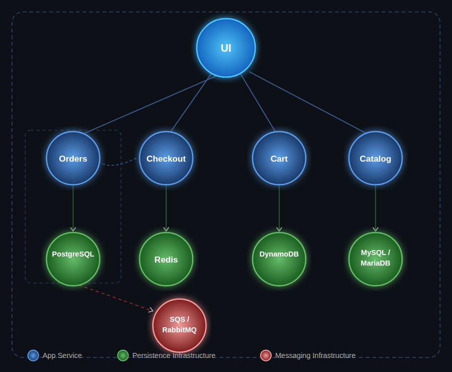
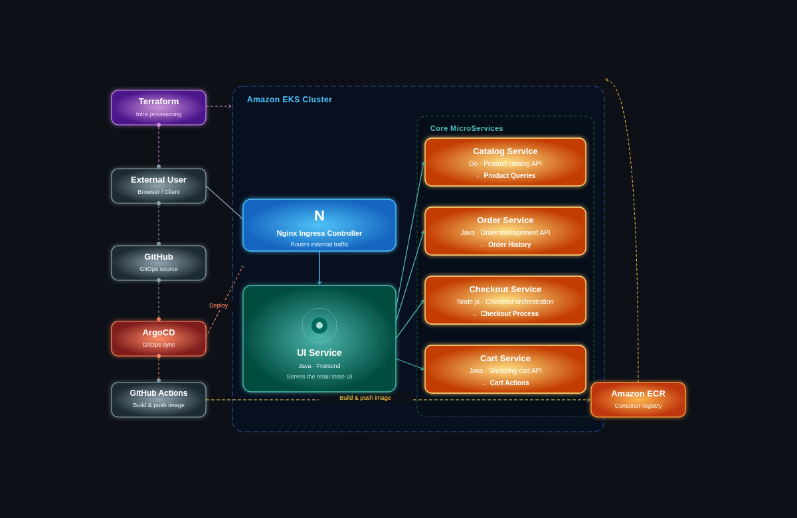
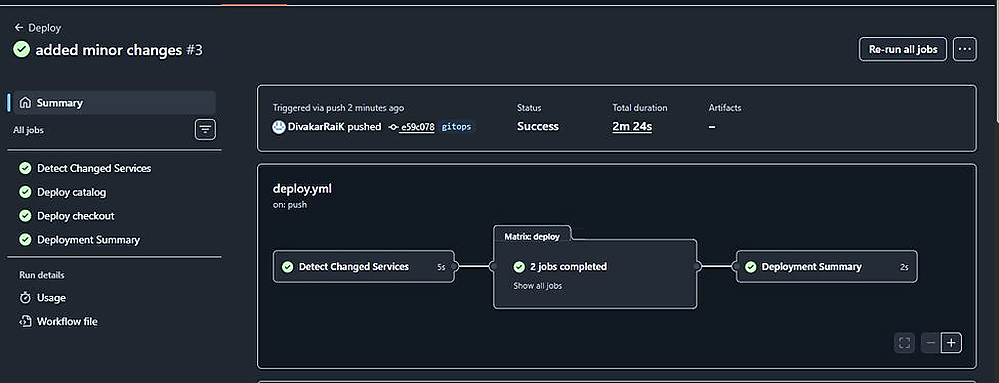
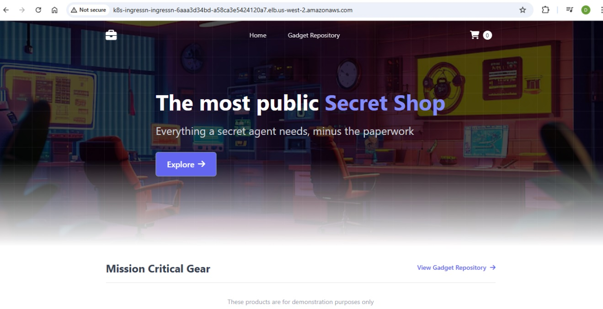
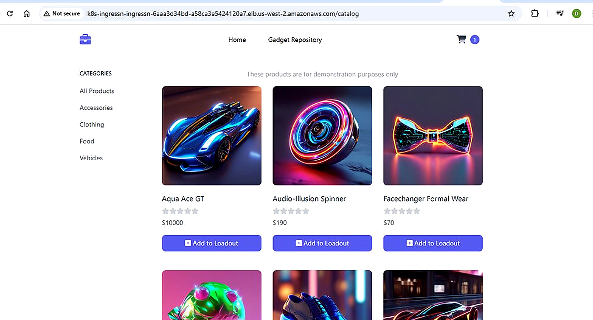
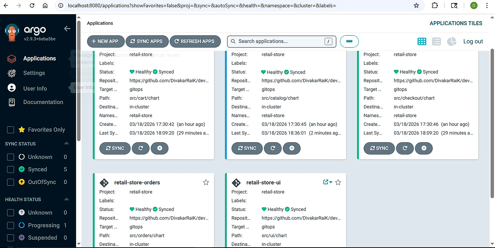
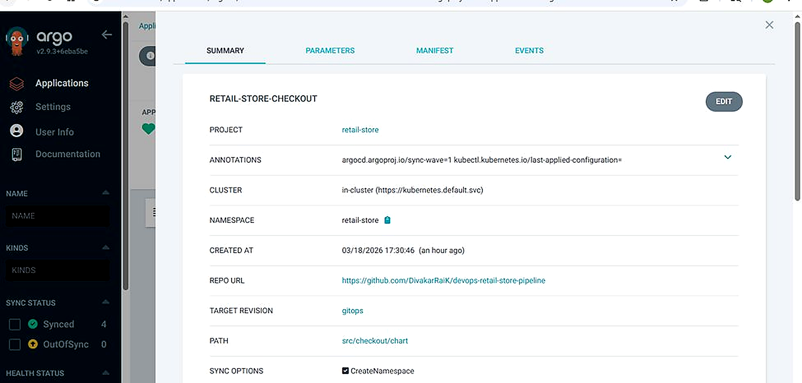
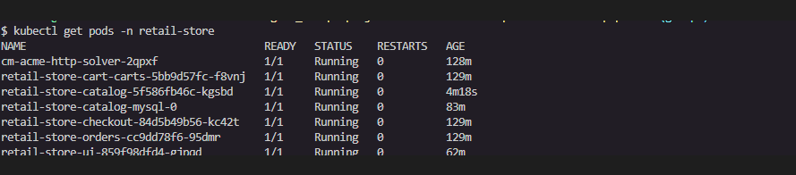
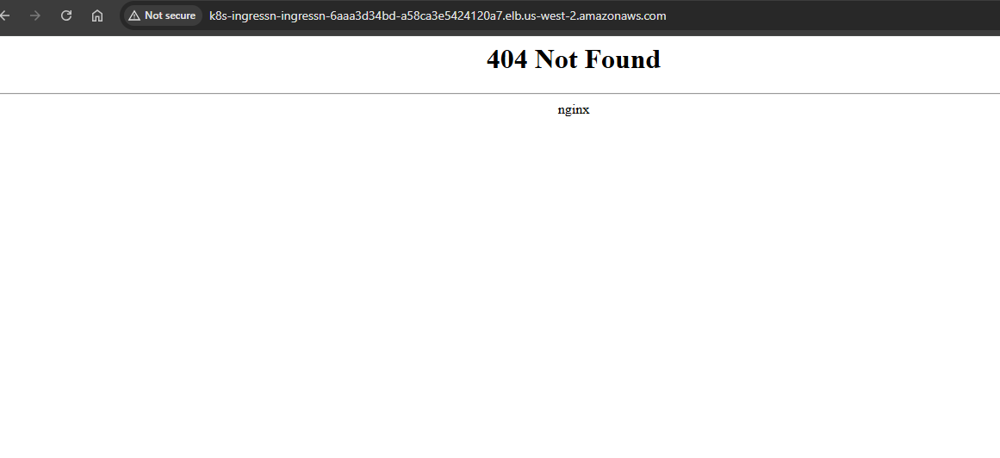

# Retail Store DevOps Pipeline

Production-grade GitOps deployment of a multi-tier microservices application on **Amazon EKS** — provisioned with Terraform, delivered continuously via ArgoCD, and automated end-to-end through GitHub Actions CI/CD.

---

## Tech Stack

| Layer | Technology |
|---|---|
| Cloud | AWS — EKS, ECR, VPC, IAM |
| Infrastructure as Code | Terraform |
| Container Orchestration | Kubernetes — Amazon EKS Auto Mode |
| GitOps / Continuous Delivery | ArgoCD |
| CI/CD Pipeline | GitHub Actions |
| Package Management | Helm |
| Ingress | NGINX Ingress Controller |
| SSL | Cert Manager |

---

## Architecture

### Microservices

Five independently deployed services, each with its own dedicated backing store — designed to reflect real-world production complexity.



| Service | Language | Backing Store |
|---|---|---|
| UI | Java | — |
| Catalog | Go | MySQL / MariaDB |
| Cart | Java | DynamoDB |
| Orders | Java | PostgreSQL |
| Checkout | Node.js | Redis + SQS / RabbitMQ |

---

### DevOps Pipeline



**End-to-end flow:**

- **Terraform** provisions the entire AWS environment — VPC, EKS cluster, IAM roles, security groups — and deploys ArgoCD and NGINX Ingress into the cluster via Helm
- A code change pushed to the `gitops` branch triggers **GitHub Actions**, which builds updated Docker images and pushes them to **Amazon ECR** tagged with the commit SHA
- **ArgoCD** continuously watches the `gitops` branch, detects the change, and automatically syncs the updated Helm charts to the live cluster
- **NGINX Ingress** routes all external traffic through the Network Load Balancer to the correct service

---

## Project Structure

```
devops-retail-store-pipeline/
├── terraform/            # VPC, EKS, IAM, Helm releases
├── argocd/
│   ├── applications/     # ArgoCD Application manifests
│   └── projects/         # ArgoCD Project manifests
├── src/
│   ├── ui/               # Java frontend + Helm chart
│   ├── catalog/          # Go catalog API + Helm chart
│   ├── cart/             # Java cart API + Helm chart
│   ├── orders/           # Java orders API + Helm chart
│   └── checkout/         # Node.js checkout API + Helm chart
└── .github/workflows/    # GitHub Actions CI/CD pipeline
```

---

## Branch Strategy

| Branch | Purpose | Images | Deployments |
|---|---|---|---|
| `main` | Stable deployment with public ECR images | Public ECR (v1.2.2) | Manual |
| `gitops` | Full CI/CD with private ECR | Private ECR (commit SHA tagged) | Automated via GitHub Actions |

---

## Deployment

Infrastructure is fully provisioned using Terraform. The cluster is configured with ArgoCD and NGINX Ingress via Helm releases. On the `gitops` branch, any push to `src/` triggers the GitHub Actions pipeline — which builds, tags, and pushes updated images to ECR. ArgoCD automatically detects the change and syncs the cluster to the new desired state.

> Full deployment walkthrough available on request.

---

## CI/CD Pipeline — GitHub Actions

Every push to the `gitops` branch automatically triggers the pipeline. It detects which services changed, builds only those images, pushes them to Amazon ECR, and reports a deployment summary — all in under 3 minutes.



---

## Application

After successful deployment, the retail store is accessible via the NGINX Ingress load balancer external IP.





---

## GitOps in Action — ArgoCD

All five application components — `cart`, `catalog`, `checkout`, `orders`, `ui` — tracked from the `gitops` branch, fully **Healthy** and **Synced**.



Each application is configured to watch a specific Helm chart path on the `gitops` branch. Any commit triggers an automatic sync — no manual intervention needed.



---

## Final State

All retail-store pods running across every service with zero restarts — including `catalog-mysql-0`, the MySQL statefulset deployed automatically as a dependency of the Catalog Helm chart.

```bash
kubectl get pods -n retail-store
```



---

## Troubleshooting

One real issue hit during deployment — diagnosed and resolved.

---

### Issue 1 — 404 Not Found on Load Balancer URL

**Symptom**

After `terraform apply` completed, the NGINX Ingress load balancer was reachable but returned a `404 Not Found`. The `retail-store` namespace was completely empty — no pods, no deployments.



**Root Cause**

Terraform timed out on the `helm_release.argocd` resource during initial cluster bring-up:

```
Error: context deadline exceeded
```

Although ArgoCD eventually came up on its own, Terraform had already aborted the run. Two dependent resources were silently skipped:

```
kubectl_manifest.argocd_projects  ← never applied
kubectl_manifest.argocd_apps      ← never applied
```

ArgoCD was running but had no Applications configured — so nothing was ever deployed. NGINX had no backend pods to route traffic to, resulting in the 404.

**Resolution**

```bash
# Confirmed the namespace was empty
kubectl get pods -n retail-store
# No resources found

# Confirmed ArgoCD had no apps configured
kubectl get applications -n argocd
# No resources found

# Re-ran Terraform once the cluster was fully stable
terraform apply --auto-approve

# Verified ArgoCD applications were created and syncing
kubectl get applications -n argocd

# Watched pods come up
kubectl get pods -n retail-store --watch
```

**Key Takeaway**

A `context deadline exceeded` in Terraform does not always mean the resource permanently failed — the underlying workload may still come up on its own. The real impact is that **all downstream dependent resources are silently skipped**. Always run `terraform state list` after a failed apply to identify what was missed, then re-run `terraform apply` once the cluster is stable.

---

## Cleanup

```bash
terraform destroy --auto-approve
```

> ECR repositories are not managed by Terraform in this setup — delete them manually from the AWS Console after running destroy.

---

## License

Licensed under the MIT-0 License. See [LICENSE](./LICENSE) for details.
